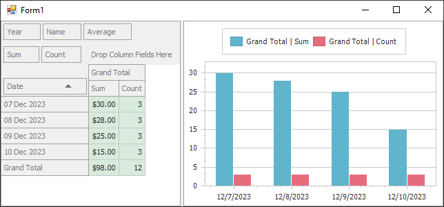

<!-- default badges list -->

<!-- default badges end -->

# WinForms - How to Highlight Pivot Grid Cells that Correspond to a Series Point on Hover

This example shows how to indicate the source data value in the Pivot Grid when a Chart's series point is located under the mouse cursor. The actual coordinates are extracted from the [SeriesPoint.Tag](https://documentation.devexpress.com/#CoreLibraries/DevExpressXtraChartsSeriesPoint_Tagtopic) property. The [PivotGridControl.CustomAppearance](https://docs.devexpress.com/WindowsForms/DevExpress.XtraPivotGrid.PivotGridControl.CustomAppearance) event applies the style for the corresponding Pivot Grid cell.

## Files to Review

* [Form1.cs](./CS/WindowsApplication53/Form1.cs) (VB: [Form1.vb](./VB/WindowsApplication53/Form1.vb))
* [Program.cs](./CS/WindowsApplication53/Program.cs) (VB: [Program.vb](./VB/WindowsApplication53/Program.vb))

## Documentation 

* [Integrate the Pivot Grid with the Chart Control](https://docs.devexpress.com/WindowsForms/8748/controls-and-libraries/pivot-grid/data-analysis/integration-with-the-chart-control)